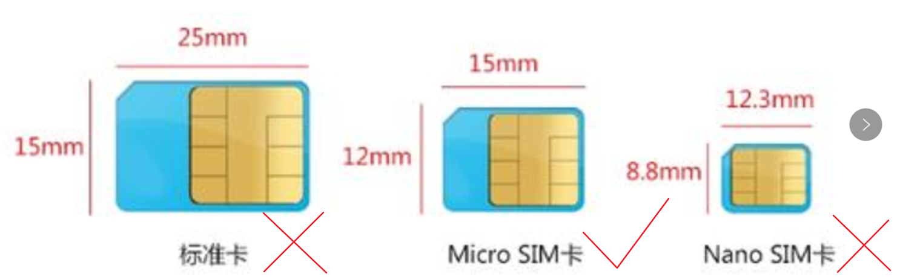

## 网关安装&接线

### 安装SIM卡

本网关支持使用移动网络联网，需要实体的SIM卡，SIM卡规格请选用micro sim卡。
三种规则的SIM卡比较图：

SIM卡安装请按如下顺序进行：

1）打开网络左侧面板上的SIM卡盖，SIM卡安装位置位于网关左侧的SIM卡插槽内，使用包装中配备的一字螺丝刀，将左侧面板上SIM卡盖上面螺丝拧下，并将SIM卡盖取下，将看到SIM卡安装位置。

2）打开SIM卡扣，用手指的指甲扣住SIM卡扣，向螺丝孔方向用力推，听到轻微的一声响后，可将卡扣翻起，这样就可以安装micro sim卡了。

3）插入SIM卡及卡托，将micro SIM卡芯片面朝下（同时缺角的远离螺丝孔）放到的SIM卡插槽，放好后，用手指的指甲扣住SIM卡扣，向远离螺丝孔方向用力推，听到轻微的一声响后松开。盖上SIM卡盖并拧紧螺丝。

注： 
●所有插拔SIM卡操作，请在网关断电时进行，严禁热插拔。 
●插入SIM卡时，务必保证芯片面朝下（同时缺角的远离螺丝孔），错误的安装可能将会使SIM卡掉落在网关内部无法取出。 

### 串口线连接

本网关具备2个串口，其中COM1是RS232/485可复用模式，COM2是RS485模式。 
当需要RS232连接时，请将串口线连接到COM1的R/T/G。当发送数据时Tx1指示灯将闪绿灯，接收数据时Rx1指示灯将闪绿灯。 
当需要RS485连接时，请将串口线连接到串口接线端子的A1和B1或A2和B2端，A表示高电平，B表示低电平。当数据传输时，高电平传输时Tx1/Tx2指示灯将闪绿灯，低电平传输时Rx1/Rx2指示灯将闪绿灯。 

注：通讯线缆推荐使用剥线或线鼻子长度为5mm，刚性或柔性导线截面为0.5mm2或0.75mm2的线。

### 网络连接

本网关具备2个10M/100M自适应网口，位于网关前面板。其中: 
LAN1口默认设置为静态IP，默认IP地址是192.168.1.248，子网掩码是255.255.255.0，属于防火墙LAN区； 
LAN2口默认设置为DHCP，属于防火墙WAN区。 
当网线连接正确，系统供电正常后，网口下方的指示灯将显示为绿色，当有数据传输时，网口上方的指示灯将闪绿灯。如想修改网关的系统设置，需要将电脑网线连接到LAN1口，如是想网关通过上级路由器上网，那么用网线连接网关LAN2口和上级路由器。 

### 电源连接

本网关默认支持24V或48V直流供电，不可连接220V交流电源，连接不适配的电源将对网关造成严重损坏。具体连接说明如下： 
1. 请先准备好24或48V直流电源，并按电源说明为其连接供电线路。 
2. 参看图12将网关上的电源接线端与电源模块的直流输出端相连，请注意正负。（本图以连接24V为例）注：线缆推荐使用剥线或线鼻子长度为5mm，刚性或柔性导线截面为0.5m2或0.75mm2的线。 

### 网关上电
第一步：检查 
		●电源线连接正确。 
		●接地线连接正确。 
		●网关支持直流24V供电。 
第二步：打开外部电源，为网关供电。 
第三步：网关上电后，PWR指示灯为绿色常亮，RUN指示灯为绿色并闪烁。 

