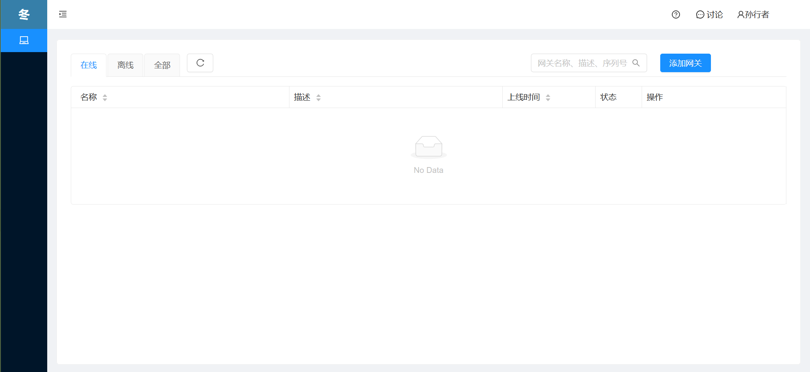
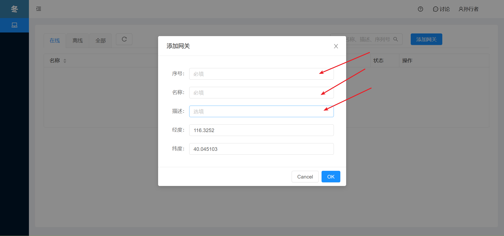
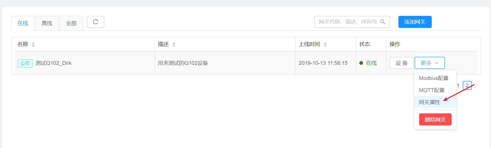

## 网关列表

登录平台成功后，首先进入的页面就是网关列表，如您手中有测试的Modbus云网关，那么你可以页面上的添加网关按钮将网关添加到自己名下。
注意：

* 如添加网关到自己名下不成功，可能是由于手中的网关不是自己所有或不是商家提供的借测网关，遇到此情况需要联系平台技术支持或厂商。 
* 如是批量购买的大量网关，厂商在出库时就会将网关绑定到您指定的账户下。就无需再次通过添加网关按钮逐个添加了。 

新用户注册登录后的界面如下：

### 添加新网关
在添加新网关界面，输入如下信息：

| 项目| 描述 | 备注 |
|:---|:---|:---|
| 序号  | 网关序列号  |  在网关侧面板可找到   |
| 名称  | 为此网关定义一个名称  |  支持任意可见字符   |
| 描述  | 为此网关定义一个描述  |  支持任意可见字符   |

### 网关属性修改

如需要对名下的网关进行属性修改，点击网关最右侧的更多按钮，在出现的下拉菜单中选择网关属性，再弹出网关属性面板中修改网关名称、描述等信息。

### 移除网关

如需要删除自己名下的网关，点击网关最右侧的更多按钮，在出现的下拉菜单中选择删除即可。

### 网关设备查看
点击网关最右侧的设备按钮，就可查看网关目前采集到Modbus设备，对一台新网关来说，在未完成Modbus配置之前，是看不到任何Modbus设备的。因此需要先了解[Modbus采集前期准备](Modbus-prepare.md)，再进行[Modbus采集应用配置](Modbus-config.md)。