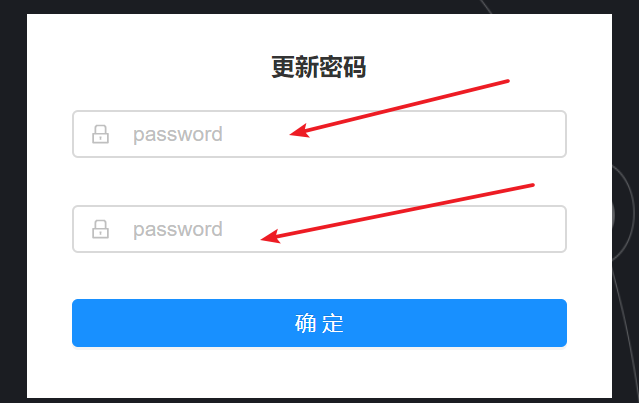

## 平台注册及登录

在浏览器打开网址 https://modbus.thingsroot.com 点击免费注册按钮。

在注册表单栏中输入邮箱（需要真实邮箱，用于接收注册邮件）、用户名（字母及数字组合），点击注册按钮注册。

提示成功后，登录注册使用的邮箱，会收到一份由平台发送的标题为“注册成功”的邮件。点击右键中的完成注册按钮将跳转到注册的最后一步。

输入密码两次，点击确定即可。

接下来就可在平台上操作您的网关了。
