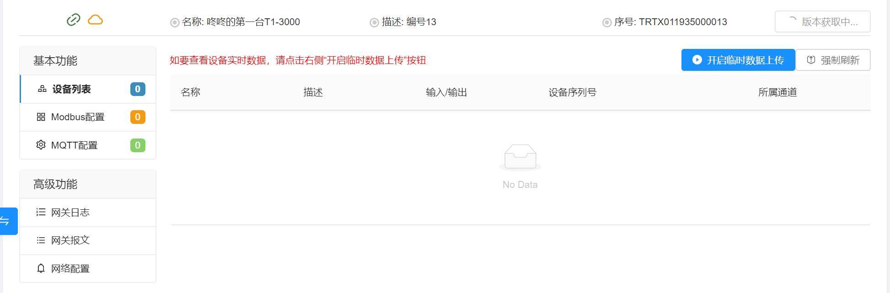
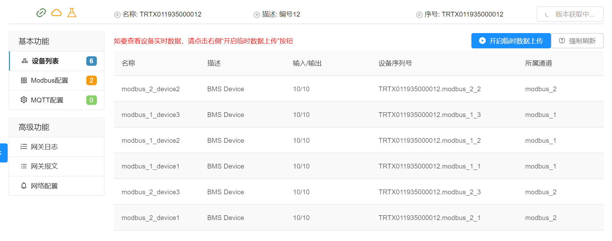
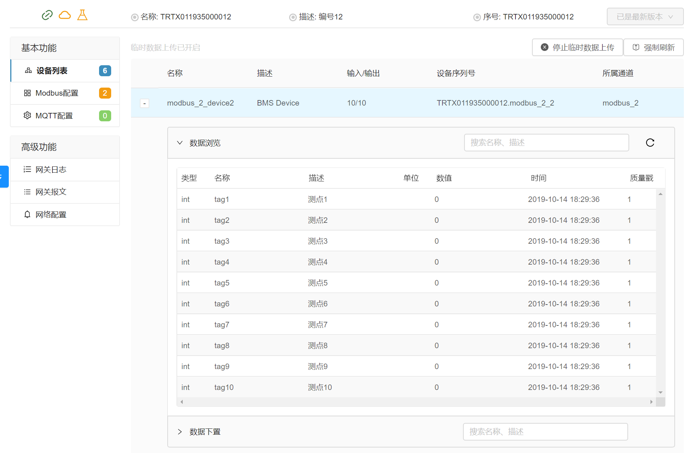

## 设备列表

设备列表提供了临时查看网关中设备数据的功能，用户未进入此功能时，网关不会向Modbus云网关配置平台上传设备的数据。只有当用户进入此功能页面同时点击开启临时数据上传时，网关才会临时将设备的数据上传到配置平台供用户查看。

* 如网关未进行Modbus配置或Modbus通道中未添加任何设备，那么在设备列表中是看不到任何设备的，如下图。

* 当Modbus通道配置正确后，在设备列表中将看到在Modbus通道下增加的设备，如下图：

* 根据页面中的提示信息，开启临时数据上传，就可以展开设备，查看设备中的变量数据了。
  

* 列表中如看不到正确的设备数据，可通过[FAQ](../part-faq/FAQ.md)检查基本的问题，还可借助通过高级功能中的网关日志和网关报文进行诊断。
  