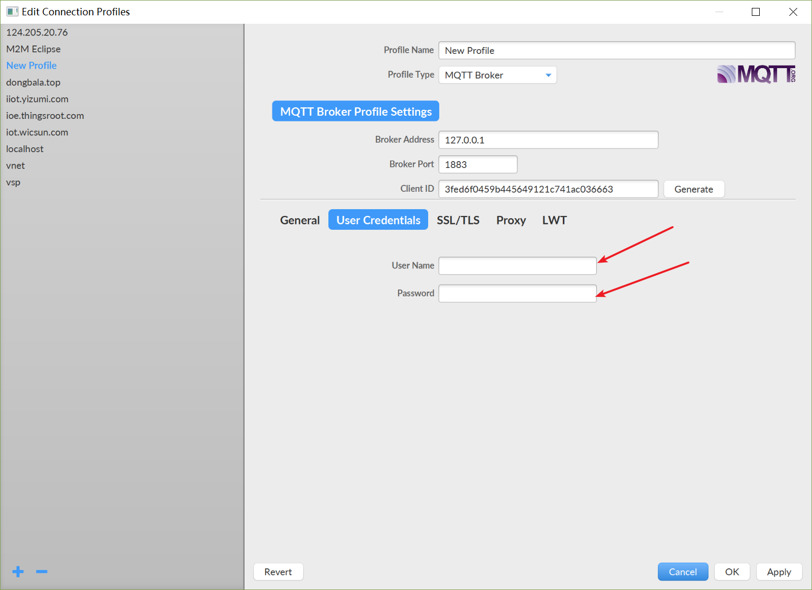

## 使用MQTT客户端验证数据

验证之前，需要认证阅读[MQTT转发协议](https://github.com/thingsroot/mqtt_standard/blob/master/%E8%AE%BE%E5%A4%87.md)。这里注意是简单测试，测试如下几个主题即可。测试之前，MQTT配置中勾选高级选项中的禁止压缩（调试使用）。

| TOPIC | 说明 |
| :--- | :--- | :--- |
| /<gateway_sn>/devices | 设备列表上送（未压缩) |
| /<gateway_sn>/data | 单个设备数据上送（未压缩) |
| /<gateway_sn>/output | 设备数据下置(网关订阅主题) |
| /<gateway_sn>/result/output | 设备数据下置结果反馈 |

### 安装MQTT客户端
这里使用网上使用者较多的mqtt客户端工具mqttfx [点击下载](http://mqttfx.jensd.de/index.php/download)。

### 连接MQTT服务器
* 安装图中标注添加MQTT　Broker。

* 设定名称，主机地址，端口，ClientID等信息。

* 如需要连接信息，则输入用户名/密码。不需要则跳过。

* 如需要SSL/TLS认证，则选择认证方式。不需要则跳过。

* 点击OK按钮后，连接MQTT Broker，如连接成功，将看到如下图的状态。

### MQTT数据相关主题说明
[MQTT数据相关主题](https://github.com/thingsroot/mqtt_standard/blob/master/%E8%AE%BE%E5%A4%87.md)

### 订阅消息(查看设备数据))
订阅实时变化数据

### 发布消息(下置设备数据)
向现场设备某个点下置数据前，需要确认目标设备的点是否允许写入。
向现场设备下置数据，通过订阅数据下置执行反馈。
