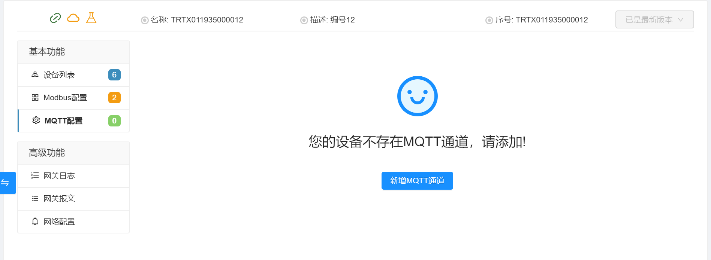
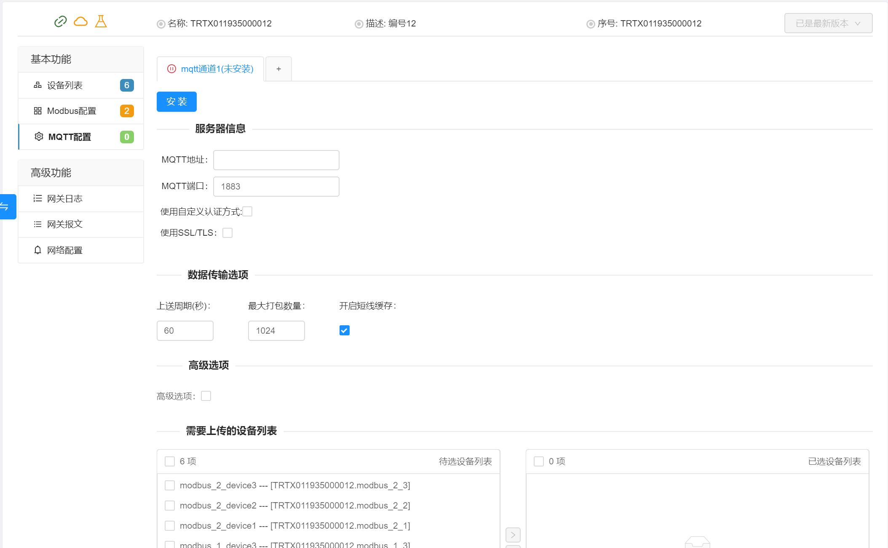
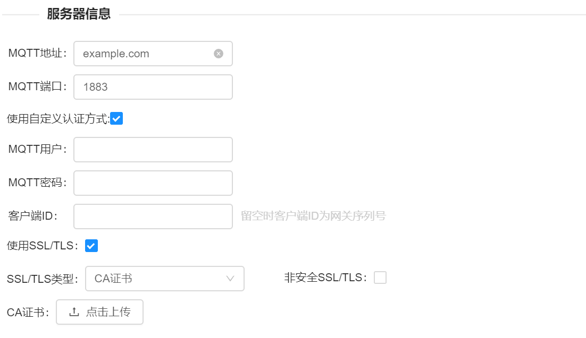
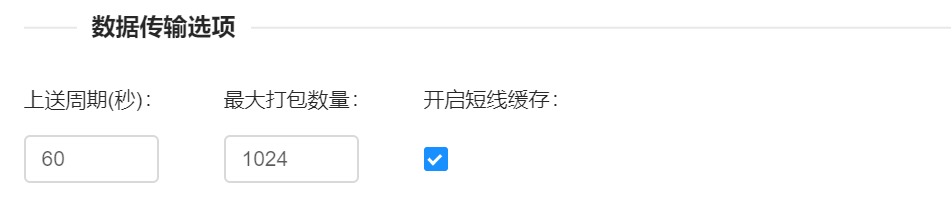
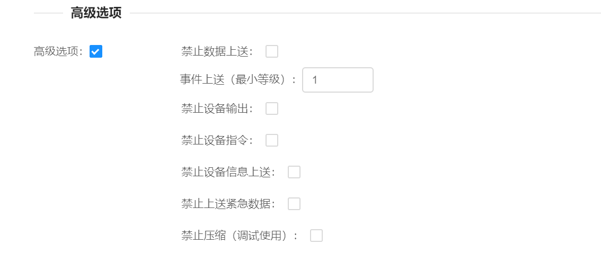
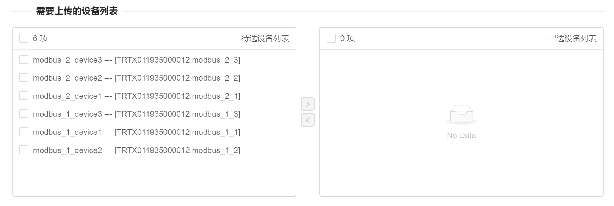

## MQTT云转发应用配置

首次打开MQTT页面时如下图所示，点击新增MQTT通道增加上传通道。

新增MQTT通道后，默认的提供的信息如下图：

### 服务器信息
服务器信息部分参数如下表：

| 参数选项         | 参数描述                                                |
| :--------------- | :------------------------------------------------------ |
| MQTT地址         | MQTT Broker服务器的地址         |
| MQTT端口         | MQTT Broker服务器的端口（默认值1883）                             |
| 使用自定义认证方式         |                                              |
| （自定义）MQTT用户     |  MQTT Broker连接用户名                        |
| （自定义）MQTT密码   |  MQTT Broker连接密码                |
| （自定义）客户端ID   |  MQTT Broker连接客户端ID，如不填写，就是网关序列号        |
| 使用SSL/TLS         |                                             |
| （SSL/TLS）CA证书   | 使用MQTT Broker服务器CA证书，                                          |
| （SSL/TLS）自签名证书     | 使用MQTT Broker服务器CA证书及客户端证书                   |

### 数据传输选项
数据传输参数如下表：

| 参数选项         | 参数描述                                                |
| :--------------- | :------------------------------------------------------ |
| 上送周期         | 网关批量上传数据的间隔        |
| 打包数量         | 网关每次批量上传数据的最大数据条数                        |
| 开启断线缓存      | 网关是否启用断线缓存，默认开启                           |

### 高级选项
高级选项一般无需配置，如是需要通过mqtt客户端程序验证数据是，可将高级选项中的禁止压缩勾选。
高级选项参数如下表：

| 参数选项         | 参数描述                                                |
| :--------------- | :------------------------------------------------------ |
| 禁止数据上送         | 禁止网关上传数据到MQTT　Broker        |
| 事件上送(最小等级)    | 大于此数值的事件等级才会被上传                    |
| 禁止设备输出     　　 | 禁止网关接收平台的数据下置操作                       |
| 禁止设备指令         | 禁止网关接收平台的指令        |
| 禁止设备信息上送         | 禁止设备信息上送，关闭后，设备点表等信息不再上传                   |
| 禁止上送紧急数据      | 禁止网关上传紧急数据，紧急数据一般数据下置成功后立即告知平台数据改变    |
| 禁止压缩（调试使用）      | 关闭上传时的数据压缩，关闭后可在MQTT客户端中看到JSON格式字符串     |

### 需要上传的设备列表
左侧列表是当前网关的所有设备，右列表是已经选择上传的设备。

### MQTT转发协议说明
[MQTT转发协议](https://github.com/thingsroot/mqtt_standard/blob/master/%E8%AE%BE%E5%A4%87.md)

