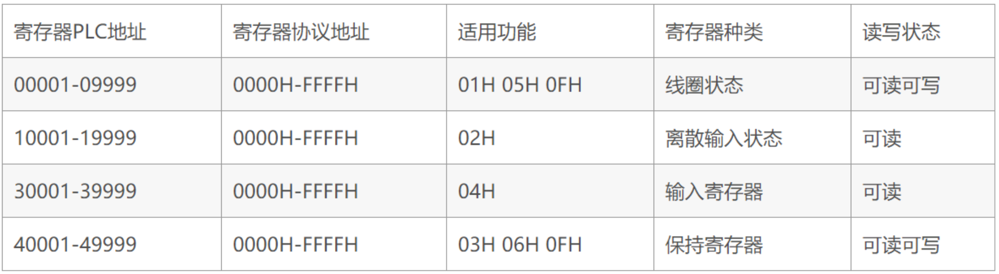
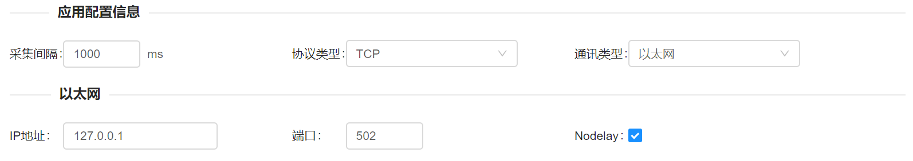
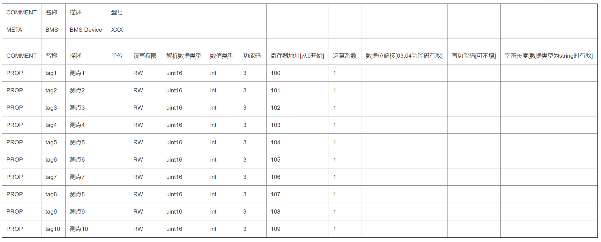
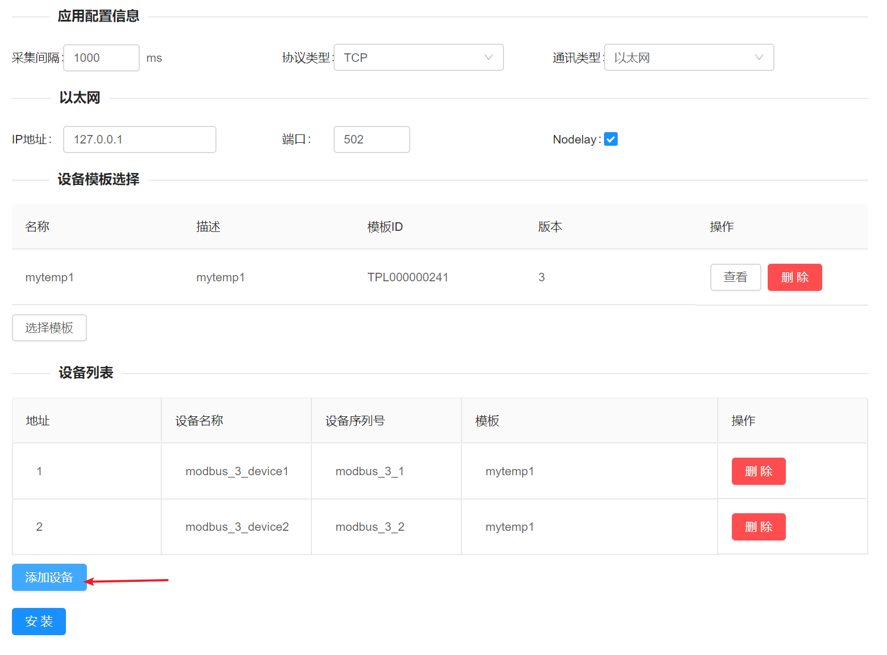

## Modbus采集配置

Modbus云网关中的Modbus采集功能是遵循Modbus标准协议开发的一个 FreeIOE 通用应用，可以和任何遵循Modbus协议（包含Modbus RTU、Modbus ASCII、Modbus TCP）标准的设备或软件通讯交互，读写这些设备或软件的数据。支持串口、TCP套接字方式。 
Modbus Master应用在Modbus RTU/Modbus ASCII协议中扮演主站的角色，主动向Modbus从站（设备）发起询问指令，请求设备返回符合请求的数据。 
Modbus Master应用在Modbus TCP协议中扮演TCP Client的角色，主动连接Modbus Server（设备）并发起询问指令，请求设备返回符合请求的数据。 
使用Modbus Master应用和Modbus设备通讯时，需要清楚的知道Modbus设备的Modbus协议地址，设备变量的功能码以及寄存器协议地址。Modbus Master应用中使用的寄存器地址是寄存器协议地址(十进制)，这和寄存器PLC地址不太一样，下图是寄存器协议地址和寄存器PLC地址的映射关系。 

### 通讯协议
[Modbus协议简介](https://wiki.freeioe.org/doku.php?id=modbus:start)

### 应用配置
Modbus应用配置界面如下图：

界面中参数及说明如下表：

| 参数选项         | 参数描述                                                |
| :--------------- | :------------------------------------------------------ |
| 采集间隔         | Modbus Master和Modbus设备通讯的间隔，默认1000ms         |
| 协议类型         | RTU/ASCII/TCP                                           |
| 通讯类型         | 串口/以太网                                             |
| （串口）端口     | COM1/COM2/… ，默认值COM1                                |
| （串口）波特率   | 1200/2400/4800/9600/19200/38400/57600/115200,默认值9600 |
| （串口）停止位   | 1/2 ，默认值1                                           |
| （串口）数据位   | 7/8 ，默认值8                                           |
| （串口）检验     | None/Even/Odd，默认值None                               |
| （以太网）IP地址 | Modbus设备的IP地址                                      |
| （以太网）端口   | Modbus设备提供服务的TCP端口                             |

### 设备模板
在选择模板弹窗中选择一个设备模板样例克隆一份到自己账户名下后，参考设备模板样例的格式制作目标Modbus设备的设备模板并上传。模板样例的格式如下图：

Modbus Master应用设备模板的字段描述如下表：
META——定义设备的属性型号等

| 项目 | 描述                                       |
| :--- | :----------------------------------------- |
| 名称 | 一般用于定义设备当前作用，根据实际情况填写 |
| 描述 | 一般指设备大类，根据实际情况填写           |
| 型号 | 一般指设备型号，根据实际情况填写           |

PROP——设备中属性点定义，包含寄存器地址，读取方式等等

| 项目                             | 描述                                                         |
| :------------------------------- | :----------------------------------------------------------- |
| 名称                             | 设备中的属性/标签/变量等的名称                               |
| 描述                             | 属性等的描述                                                 |
| 型号                             | 属性等的单位                                                 |
| 读写权限                         | RO-只读，WO-只写，RW-读写                                    |
| 解析数据类型                     | 对Modbus返回数据进行解码时的数据类型可用:  [bit,int8,uint8,int16,uint16,int32,int32_r,uint,uint32_r,float,float_r,double,double_r,string]   其中int32_r uint32_r float_r double_r表示使用内存数据是反向排序（排序单位是两个字节)，  例如: int32的值为A1B2C3D4 int32_r的值为D4C3B2A1 |
| 数值类型                         | 设备属性点数值类型，FreeIOE支持的类型有int, float, string三种类型 |
| 功能码                           | Modbus读取指令码的十进制，支持01, 02, 03, 04。 01, 02功能码的data_type只能是bit |
| 运算系数                         | 将获取的modbus数据按照数据类型(data_type)进行解析后，乘以rate作为属性数据。缺省为1 |
| 数据位偏移[从0开始]              | 在03, 04功能码读取寄存器时，可以指定offset. （01, 02不支持指定offset操作) ，  在解析数据类型为bit的时候offset是指位偏移数，解析数据类型为int8,uint8类型时是指字节偏移数（0或者1）。 |
| 写功能码[可不填]                 | 指定写操作的功能码，默认情况下，与功能码的对应关系如下: 01 → 05，03 → 06 |
| 字符长度[数据类型为string时有效] | 当按照裸字符串进行读写(data_type 为 string或raw)时，需要指定此长度。 |

### 设备添加
添加Modbus设备的界面如下图：

表格中的参数选项描述如下表：

| 项目                                     | 描述                                                         |
| :--------------------------------------- | :----------------------------------------------------------- |
| 地址                                  | Modbus协议中定义的设备地址                                                   |
| 设备名称                             | 设备功能描述                                                 |
| 设备序列号                     | 设备序列号，当前网关下面需要保证序列号唯一。                 |
| 模板                                 | 设备模板                                                     |
| 操作 | 默认选中，尽量不要去掉勾选，除非你设备的虚拟号能保证全局唯一。 |

### 提示
Modbus通道最多可创建8个，而且Modbus串口的通道还收到网关物理串口数量的限制。

------
Modbus配置完成后，可通过[设备列表](Devices-list.md)查看目标设备的数据是否正确采集
